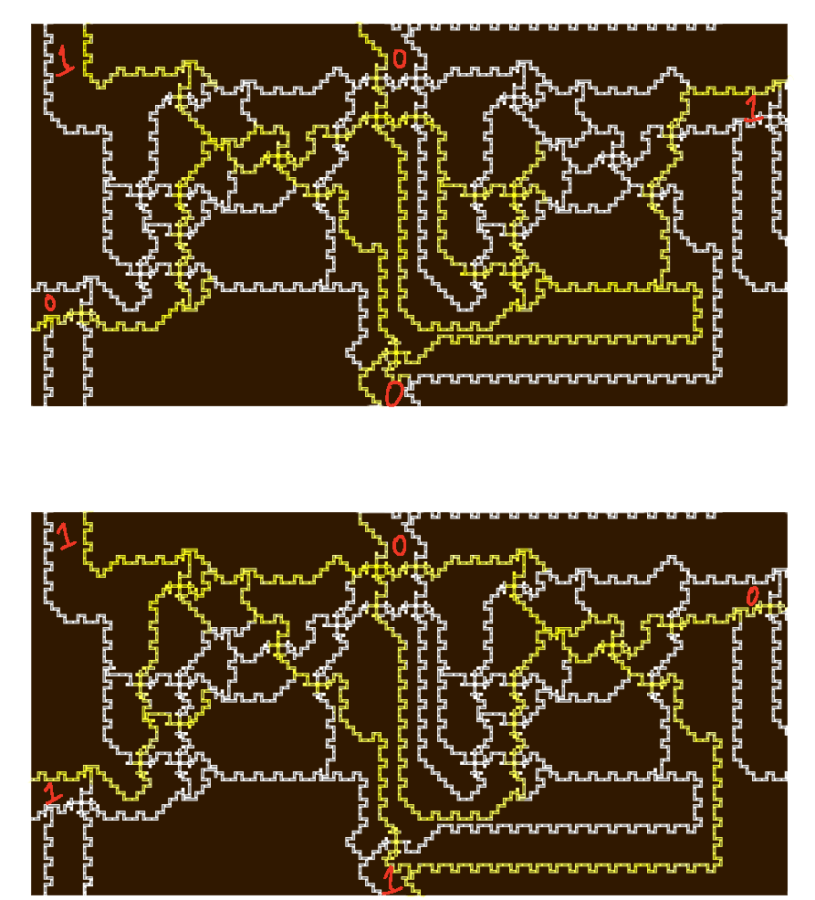

# Parking
**Category:** Hardware

**Points:** 234

**Description:**
> It's so crowded today... Can you fit our car in?
>
> **Given:** game.py, level1, level2, run.sh

## Writeup
This was a very tough challenge and it took me approximately 25 hours after the
competition began to solve it (well I slept a little). Overall, this challenge
was awesome and I'm glad I spent my time solving it. Now, let's get started.

We are given a zip file containing the four files stated above: two level files,
a bash script, and a game file written in Python. The `game.py` program consisted
of functions rendering the challenge level from the level files. The bash script
only printed some information, then just ran `game.py` with the first level `level1`
and the second level `level2` after solving the first one, of course. The information
from `run.sh` is:

```
$ ./run.sh
Welcome to our game. You need to enter the red vehicle into a crowded parking lot.
There are two levels: the first is introductory, just so you know the rules; the second, when solved, will reveal the flag. Good luck!
```

</br>

I run WSL for Linux (yeah I know I need to setup a VM), so the Python graphing
library didn't really work for me, sooooooo I just ran it all on Windows instead.

```
>py game.py level1
Here's the parking. Can you move the red car?
Green cars' final position will encode the flag.
Move by clicking a car, then clicking a near empty space to move to. Feel free to zoom in using the magnifying glass if necessary!
Redrawing...
Redrawn.
Saving...
Saved.

```

</br>


</br>

This was just a warmup level as stated above and all it took was moving the green
and gray vertical cars down, the top horizontal car over to the left, the middle
vertical car up, and finally the red car out to the left. You can do this by
clicking on the car to move, then clicking in the direction of where the car
should move (no dragging involved). Vertical cars seem to only move up and down
while horizontal cars seem to only move left and right (makes sense). Of course
we can't move a car into a wall, which are pictured as brown on the board. Here
is the output of the program after making the five moves stated above.


```
Car 0 selected.
This setting corresponds to the following flag:
b'CTF{\x01}'
Redrawing...
Redrawn.
Car 1 selected.
Redrawing...
Redrawn.
Car 2 selected.
Redrawing...
Redrawn.
Car 2 selected.
Redrawing...
Redrawn.
Car 3 selected.
Redrawing...
Redrawn.
Car 4 selected.
Redrawing...
Redrawn.
Congratulations, here's your flag:
b'CTF{\x01}'
```

</br>

Interesting. Let's look at the second level. Upon running `py game.py level2`,
we get a massive plot. And I mean **MASSIVE**. It takes a couple seconds for the
Python graphing interface to process each one of my actions.


	
</br>

One of my teammates snagged a PNG (`initial.png`) of the game board somehow and
I will include it with this writeup since it is much easier to navigate rather
than the game board since it's laggy.

At first glance of the game board, I asked myself "what in the world even is this?",
but after hours of staring and dissecting, stuff started to click in my head.
One of my teammates mentioned a circuit challenge from a different competition
and I started to think in that mindset. After all, this was a *hardware* challenge.

Thinking back to the original aspect of the game, we need to find where the red
and green cars are located. `game.py` provides us with some information on how
it's parsing these level files:

</br>

```python
boardfile = open(sys.argv[1]).read()
header, boardfile = boardfile.split("\n", 1)
W, H = [int(x) for x in header.split()]

for line in boardfile.splitlines():
    if not line.strip(): continue
    x,y,w,h,movable = [int(x) for x in line.split()]

    if movable == -1:
        flagblocks[len(blocks)] = (x,y)
    elif movable == -2:
        target = len(blocks)
        target_start = x, y

    for i in range(x, x+w):
        for j in range(y, y+h):
            if movable != 0:
                if (i,j) in board:
                    print("Car overlap at %d, %d" % (i,j))
                    #assert False
                board[(i,j)] = len(blocks)
            else:
                if (i,j) in board and board[i,j] != WALL:
                    print("Wall-car overlap at %d, %d" % (i,j))
                    #assert False
                board[(i,j)] = WALL
    if movable:
        blocks.append([x,y,w,h, movable])
    else:
        walls.append([x,y,w,h])
```

</br>

This **for loop** here reads in the `level*` file, classifies the first line as
the size of the game board, and iterating over the rest of the lines as it contains
the positioning of the cars in the form `x y w h movable`. Take `level1` for example:

```
7 7
0 0 7 1 0
0 0 1 6 0
0 5 7 1 0
5 0 1 3 0
6 0 1 6 0
5 4 1 2 0
3 4 1 1 0
1 1 1 3 -1
2 1 1 3 1
3 1 2 1 1
3 2 1 2 1
4 3 2 1 -2
```

</br>

Looking at the loop even further, we see that there are different values for `movable`.
```
-2 ---> start car (red)
-1 ---> flag car (green)
 0 ---> wall (brown)
 1 ---> moving car (gray)

```

Using this knowledge, we can do a quick search for how many instances of **-1**
and **-2** there are in `level2` and there turned out to be **64** and **1**
respectively. The red starting car is located in the bottom right of the game board
and the green flag cars are located on the left side of the game board (spread out
  along the side)!


</br>

The green cars seem to be in an on/off position or more simply: 1 or 0. I mean this
kind of makes sense, right? 64 green cars. 1 or 0. What happens when we move it?

```
Car 3 selected.
This setting corresponds to the following flag:
b'CTF{\x01\x00\x00\x00\x00\x00\x00\x00}'
Redrawing...
Redrawn.
```

</br>

It looks like it flipped the 0th bit of the first byte (we flipped the green car
at the very top of the game board). If we flip the board counter-clockwise we can
view the indices of the bits as such:
```
01234567 01234567 01234567 01234567 01234567 01234567 01234567 01234567
```

Here are the 8 bytes corresponding to the printed flag (the number being the index
of the byte), which we need to find somehow. From glancing at the whole game board,
this seems to be some sort of circuit we need to reverse. Let's dive a little deeper.
There are two elements we need to understand within this whole circuit.

</br>


</br>

Now what could these be? For the first block (the smaller one), we have two inputs
and one output. For the second block, we have three inputs and two outputs. We
should make a truth table to derive the type of logic happening within these blocks.

**Quick Note:** *This took a lot of staring to figure out how the flow of input and*
*output goes. It seems like there are more inputs and outputs than what I said,*
*but each pair of "car streams" corresponds to a bit being 0 or 1.* Here are the possibilities for both blocks with inputs on the top or to the left and the outputs being on the bottom or to the right.
</br>


<p float="left">
	
	
</p>
<p float="left">
	
	
</p>

</br>

#### Small Block

| a | b | | out |
| - | - |-|:---:|
| 0 | 0 | |  0  | 
| 0 | 1 | |  1  |
| 1 | 0 | |  1  | 
| 1 | 1 | |  0  |

</br>

#### Big Block     
*outR = output on the right*
*outB = output on the bottom*
*inputs start at bottom left and go counter clockwise*

| a | b | c | | outB | outR |
| - | - | - |-|:----:|:----:|
| 0 | 0 | 0 | |  0   |  0   | 
| 0 | 0 | 1 | |  0   |  1   |
| 0 | 1 | 0 | |  0   |  1   |
| 0 | 1 | 1 | |  1   |  0   |
| 1 | 0 | 0 | |  0   |  1   | 
| 1 | 0 | 1 | |  1   |  0   |
| 1 | 1 | 0 | |  1   |  0   |
| 1 | 1 | 1 | |  1   |  1   |

</br>

Based on our truth tables above, we can see that the small block is simply an XOR gate. The bottom output of the bigger block is an XOR as well. The right output of the bigger block is a little more complicated. For this case, we can use a karnaugh map to determine the logic.


 
 </br>
 
 With this logic in mind, we can take a look at the bigger picture again and see how this is all connected.
 
 </br>
 
<object data="full_game_board.PDF" type="application/pdf" width="700px" height="700px">
    <embed src="full_game_board.PDF">
        <p> <a href="full_game_board.PDF">Game board as circuit</a></p>
    </embed>
</object>

</br>

This PDF shows the circuit in it's entirety. We are given some inputs at some of the "layers" within this circuit. Let's implement this within Python's z3 module since we can translate our circuit and solve it automatically. We can start with the first layer, which is the very left side of the circuit (all of the XOR gates with the green flag cars). *The* *`inp_consts` were taken from top to bottom.*

```python
from z3 import *

s = Solver()

# layer 1
bits = [Bool(str(i)) for i in range(64)]
bits_copied = [Bool(str(i)) for i in range(64)]
inp_consts = "0 1 1 1 1 0 1 1 0 0 0 0 0 0 1 1 1 0 1 1 0 1 0 1 0 1 1 1 1 0 1 1 0 1 1 1 1 0 1 1 0 0 0 0 0 0 1 1 1 0 1 1 0 1 0 1 0 1 1 1 1 0 1 1"
inp_consts = list(map(lambda x: bool(int(x)), inp_consts.split()))
assert len(inp_consts) == 64

for i in range(len(bits)):
    bits[i] = Xor(bits[i], inp_consts[i])
```

</br>

For the next layer of gates, we are looking at our complicated big block. We have to keep track of the output of the block before, so we will be storing that in `most_recent`. The first two triple XOR gates we are adding represent the first two at the top since they are special cases with regards to input. The remaining blocks below depend on the previous two blocks. Refer to the PDF if this is still confusing.

```python
def triple_xor(a, b, c):
    return Xor(Xor(a, b), c)

# layer 2
outs = []
outs.append(triple_xor(False, False, bits[0]))
most_recent = Or(And(False, bits[0]), And(False, bits[0]), And(False, False))
outs.append(triple_xor(most_recent, bits[0], bits[1]))
most_recent = Or(And(most_recent, bits[1]), And(most_recent, bits[0]), And(bits[1], bits[0]))

for i in range(2, 64):
    a = i-2
    b = i-1
    c = i
    print(a, b, c)
    outs.append(triple_xor(most_recent, bits[b], bits[c]))
    most_recent = Or(And(most_recent, bits[c]), And(most_recent, bits[b]), And(bits[b], bits[c]))

assert len(outs) == 64, len(outs)
```

</br>

Now we have another layer of XOR gates, which takes in input from two outputs from the previous layer. There is one input we know from this layer and it is `0` fed into a gate at the very bottom of the layer.

```python
# layer 3
outs_2 = []
for i in range(1, 64):
    outs_2.append(Xor(outs[i-1], outs[i]))
outs_2.append(Xor(False, outs[-1]))

assert len(outs_2) == 64, len(outs_2)
```

</br>

For the last layer, I kind of included the rightmost layer of XOR gates because the output isn't so straightforward. From looking at the gates on the very right, one can tell what needs to be fed into the XOR gate in order for the cars to move correctly. We will need to use the same `most_recent` type of variable as we are dealing with the same big block. The only major caveat here is that the output from the top of the previous layer is routed down to the very bottom (this is the pair of vertical lines going down the middle of the game board).

```python
# layer 3
bottom_consts = "0 1 1 1 0 1 1 0 0 1 1 0 0 1 0 0 0 1 1 1 0 1 1 0 0 1 1 0 0 1 0 0 0 1 1 1 0 1 1 0 0 1 1 0 0 1 0 0 0 1 1 1 0 1 1 0 0 1 1 0 0 1 0 0"
bottom_consts = list(map(lambda x: bool(int(x)), bottom_consts.split()))
assert len(bottom_consts) == 64

out_consts = "0 0 1 0 1 0 0 0 0 0 0 1 0 0 0 0 1 1 1 0 0 1 1 0 1 0 0 0 1 0 1 0 1 1 0 1 0 1 0 1 0 1 0 0 0 0 1 0 1 1 0 1 0 1 0 0 0 1 1 1 1 1 0 0"
out_consts = list(map(lambda x: bool(int(x)), out_consts.split()))
assert len(out_consts) == 64

s.add(triple_xor(False, outs_2[1], True) == False)
most_recent = Or(And(False, True), And(False, outs_2[1]), And(outs_2[1], True))

for i in range(2, len(outs_2)):
    print(i-1, i, bottom_consts[i], out_consts[i])
    s.add(triple_xor(most_recent, outs_2[i], bottom_consts[i]) == out_consts[i])
    most_recent = Or(And(most_recent, bottom_consts[i]), And(most_recent, outs_2[i]), And(outs_2[i], bottom_consts[i]))

s.add(triple_xor(most_recent, outs_2[0], False) == False)
```

</br>

Finally, we can model this circuit and solve it with z3's solver.

```python
assert len(s.assertions()) == 64
print(s.check())
model = s.model()
print(m)

out = ''
for i in range(64):
    out += str(int(bool(model[bits_copied[i]])))

print(out)
flag = b"CTF{"
while out:
    byte, out = out[:8], out[8:]
    flag += bytes([ int(byte[::-1], 2) ])
flag += b"}"

print(flag)
```

</br>

Running this script will give us the flag! Once again, this was a really interesting challenge and I learned how to use a little bit of z3 as a result of this. Shoutout to 

## Flag
`CTF{2TheBr1m}`

## Resources
[Z3 Repo](https://github.com/Z3Prover/z3)

[Z3 Guide](https://ericpony.github.io/z3py-tutorial/guide-examples.htm)
