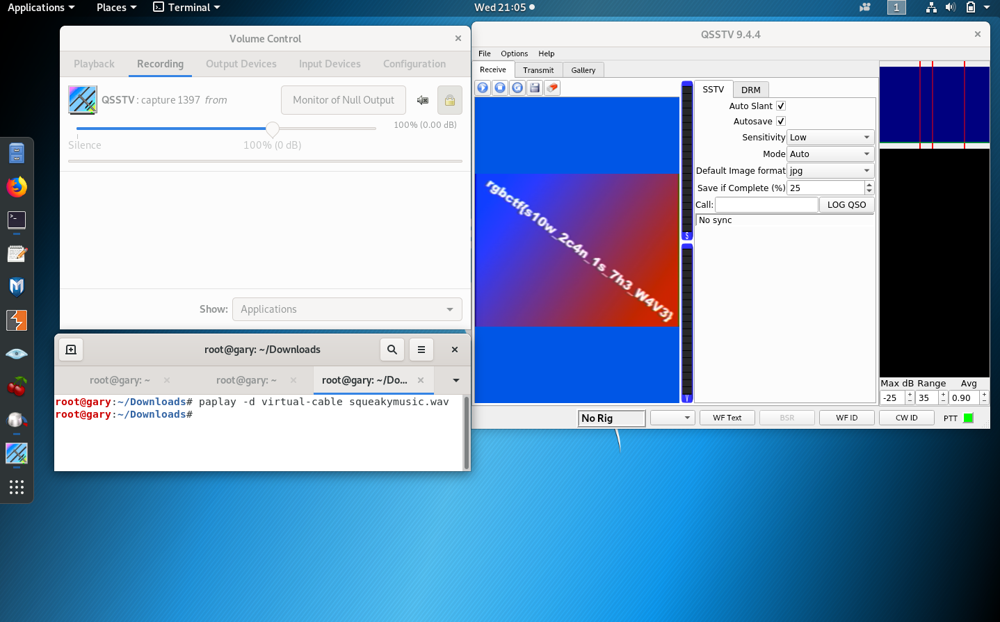

# Alien Transmission 1
**Category:** Forensics/OSINT

**Points:** 219

**Description:**
> I was listening to my radio the other day and received this strange message...
I think it came from an alien?
>
> ~BobbaTea#6235
>
> **Given:** command_1

## Writeup
Listening to the message doesn't really give us much, but we have a few ways to
try to analyze this. First thing I do is pop it open in **Sonic Visualizer** to see
if anything pops up in the spectrogram or if I can see anything interesting like
a pattern in the frequencies, but nothing special there.

After a little digging, I remembered there is a thing called Slow-Scan Television
(SSTV)! This is a form of steganography used nowadays to hide JPEGs
or PNGs in WAV audio files, but it was originally used to transmit images via radio
signals from the moon and back. There is a Wiki page on SSTV and is worth the read!

There is a writeup done on a similar challenge from picoCTF 2019, which I will
provide in the references because I pretty much go off of it. There is a Linux
application called Qsstv, which looks for SSTV images in a wav file.

```
$ apt-get install qsstv
$ pactl load-module module-null-sink sink_name=virtual-cable
22
$ pavucontrol # A GUI will pop-up, go to the "Output Devices" tab to verify that you have the "Null Output" device
$ qsstv # The program GUI will pop-up, go to "Options" -> "Configuration" -> "Sound" and select the "PulseAudio" Audio Interface
$ # Back in the pavucontrol GUI, select the "Recording" tab and specify that QSSTV should capture audio from the Null Output
$ paplay -d virtual-cable <wav file>
```



## Flag
rgbCTF{s10w_2c4n_1s_7h3_W4V3}

## Resources
[m00nwalk writeup](https://github.com/Dvd848/CTFs/blob/master/2019_picoCTF/m00nwalk.md)

[SSTV Wiki](https://en.wikipedia.org/wiki/Slow-scan_television)
