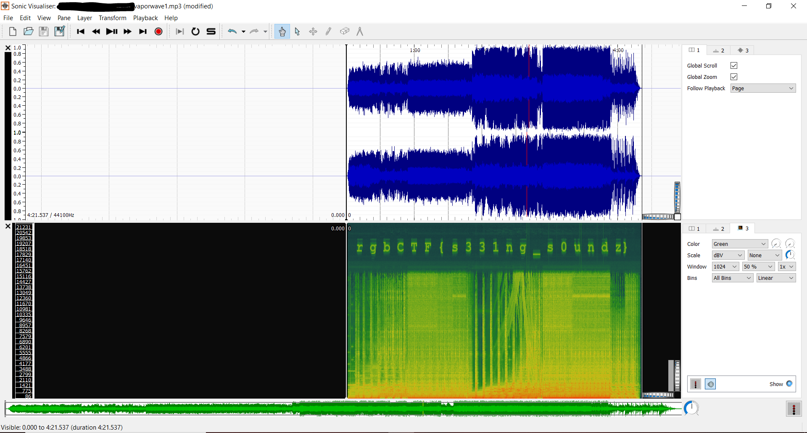

# vaporize1
**Category:** ZTC

**Points:** 190

**Description:**
> Do you believe in synesthesia?
>
> ~ztcintern#5015
>
> **Given:** vaporize1.mp3

## Writeup
One of the first things I usually do when given an audio file (MP3 or WAV) is
check the spectrogram in **Sonic Visualizer** or **Audacity**. I usually prefer **Sonic
Visualizer**, which is what I will use here. Pulling the spectrogram up gives us
the flag.

## Flag
rgbCTF{s331ng_s0undz}

## Resources
[Audacity](https://www.audacityteam.org/)

[Sonic Visualizer](https://www.sonicvisualiser.org/)
